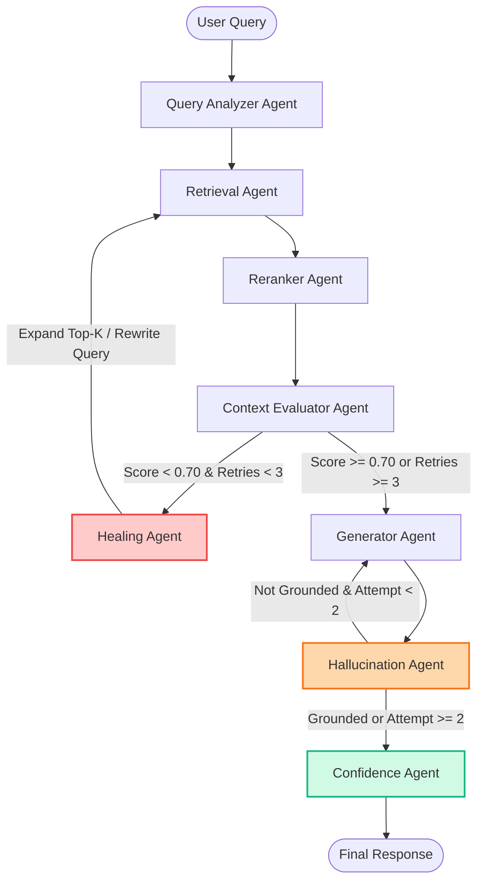

# Self-Healing RAG Platform: End-to-End System Walkthrough & Integration Report

This report provides a comprehensive, detailed guide of the **Self-Healing RAG Platform** codebase. It covers both the FastAPI backend (with its 8-agent LangGraph orchestrator) and the React frontend operations dashboard.

---

## 1. System Vision & Architecture

Traditional Retrieval-Augmented Generation (RAG) systems fail when initial document retrieval returns irrelevant context, causing the LLM to either hallucinate or output an incomplete response. This platform solves this by implementing **autonomous error recovery (self-healing)**.

The system is built as a state machine orchestrated by **LangGraph**. The workflow constantly checks context sufficiency and answer grounding. If a check fails, the state machine rolls back to query rewriting, expands the vector search range, or regenerates the answer with stricter constraints.

### Workflow Diagram



---

## 2. Backend Orchestration: The 8 Specialized Agents

The backend architecture separates logic into 8 specialized agents situated in [`backend/app/agents/`](file:///c:/Users/shiva/Desktop/Self%20healing%20RAG/backend/app/agents/). They communicate through a shared state (`RAGState`) defined in [`backend/app/workflows/rag_graph.py`](file:///c:/Users/shiva/Desktop/Self%20healing%20RAG/backend/app/workflows/rag_graph.py).

### 1. Query Analyzer Agent
* **File:** [`query_analyzer.py`](file:///c:/Users/shiva/Desktop/Self%20healing%20RAG/backend/app/agents/query_analyzer.py)
* **Role:** Analyzes the raw user query for ambiguity, brevity, or spelling errors.
* **Output:** Sanitized, improved query version, along with 3 to 5 semantically distinct sub-queries (Multi-Query expansion) to maximize retrieval coverage.

### 2. Retrieval Agent
* **File:** [`retrieval_agent.py`](file:///c:/Users/shiva/Desktop/Self%20healing%20RAG/backend/app/agents/retrieval_agent.py)
* **Role:** Performs hybrid search (dense + sparse keyword matching) against the Pinecone Vector Database using **BGE-M3** embeddings.
* **Output:** Extracts candidate chunks (defaults to top-20) containing text snippets, document IDs, page references, and metadata.

### 3. Reranker Agent
* **File:** [`reranker_agent.py`](file:///c:/Users/shiva/Desktop/Self%20healing%20RAG/backend/app/agents/reranker_agent.py)
* **Role:** Uses a cross-encoder model (**BGE-reranker-large**) to re-evaluate the relevance of all retrieved chunks relative to the user's intent.
* **Output:** Sorts the chunks and filters them down to the top-5 most relevant results.

### 4. Context Evaluator Agent
* **File:** [`context_evaluator.py`](file:///c:/Users/shiva/Desktop/Self%20healing%20RAG/backend/app/agents/context_evaluator.py)
* **Role:** Determines whether the top-5 reranked chunks contain sufficient information to answer the query. It uses a weighted formula (40% heuristic overlap/relevance + 60% LLM semantic assessment).
* **Threshold:** If the combined score is **< 0.70**, it sets `needs_retry = true`, triggering the self-healing loop.

### 5. Healing Agent
* **File:** [`healing_agent.py`](file:///c:/Users/shiva/Desktop/Self%20healing%20RAG/backend/app/agents/healing_agent.py)
* **Role:** Triggered when the context evaluation is insufficient. It increments the retry counter and applies progressive recovery strategies:
  * **Attempt 1:** Rewrites the query utilizing LLM domain expansion.
  * **Attempt 2:** Increases retrieval size by 50% ($1.5 \times \text{top\_k}$).
  * **Attempt 3:** Aggressively expands queries, increases retrieval by 100% ($2.0 \times \text{top\_k}$), and removes metadata filter constraints.
* **Max Retries:** 3 attempts. If still insufficient, the workflow proceeds to generation using the best available context.

### 6. Generator Agent
* **File:** [`generator_agent.py`](file:///c:/Users/shiva/Desktop/Self%20healing%20RAG/backend/app/agents/generator_agent.py)
* **Role:** Prompts the local LLM (**Llama 3** via Ollama) to answer the query. It enforces strict grounding instructions, requiring citations for every factual claim.
* **Output:** An answer utilizing bracketed reference markers (e.g., `[document_name.pdf, Page X]`).

### 7. Hallucination Agent
* **File:** [`hallucination_agent.py`](file:///c:/Users/shiva/Desktop/Self%20healing%20RAG/backend/app/agents/hallucination_agent.py)
* **Role:** Conducts post-generation validation using LLM-as-judge. It checks the answer against the retrieved chunks for unsupported claims, contradictions, and missing citations.
* **Recovery:** If the grounding score is **< 0.70**, it triggers a one-time regeneration loop with an extra-strict grounding prompt.

### 8. Confidence Agent
* **File:** [`confidence_agent.py`](file:///c:/Users/shiva/Desktop/Self%20healing%20RAG/backend/app/agents/confidence_agent.py)
* **Role:** Computes a composite confidence metric signaling answer trust.
* **Score Weights:** 
  $$\text{Confidence} = 25\% (\text{Retrieval score}) + 30\% (\text{Context score}) + 30\% (\text{Grounding score}) + 15\% (\text{Citation coverage})$$

---

## 3. Backend Architecture & APIs

The backend is built with **FastAPI** (located in [`backend/app/`](file:///c:/Users/shiva/Desktop/Self%20healing%20RAG/backend/app/)) and features high-efficiency resource caching.

### Resource Caching & Lifecycle
* **Lifespan Manager ([`main.py`](file:///c:/Users/shiva/Desktop/Self%20healing%20RAG/backend/app/main.py)):** Heavy models (BGE-M3 vectorizers, BGE Reranker) and database connectors (Pinecone client) are loaded once at startup and cached in memory.
* **Request ID Middleware:** Generates and appends a correlation ID (`X-Request-ID`) to logs and headers to allow granular trace tracking and latency profiling.

### Key API Endpoints
* `POST /api/v1/chat` - Submits a query. Returns the answer, cited sources, confidence breakdown, healing attempts, and processing latency.
* `POST /api/v1/upload` - Uploads document attachments, processes text chunking, embeds content, and saves vectors to Pinecone.
* `GET /api/v1/health` - Inspects service connections (Ollama, Pinecone status).
* `GET /api/v1/metrics` - Exposes system telemetry (average latency, average confidence score, healing rate, and hallucination metrics).

---

## 4. Frontend Architecture & Portals

The frontend is a modern SPA written in **React + Vite** with global state managed via **Zustand** ([`frontend/src/store/appStore.js`](file:///c:/Users/shiva/Desktop/Self%20healing%20RAG/frontend/src/store/appStore.js)). Styling is managed via vanilla CSS located in [`frontend/src/index.css`](file:///c:/Users/shiva/Desktop/Self%20healing%20RAG/frontend/src/index.css).

The application is structured around a central **Operations Hub** that acts as the entry point:

```
                  ┌───────────────┐
                  │   Hub.jsx     │
                  └───────┬───────┘
         ┌────────┬───────┼────────┬────────┐
         ▼        ▼       ▼        ▼        ▼
    Dashboard    Chat  Analytics  Admin   (App.css / index.css)
```

### 1. Operations Hub ([`Hub.jsx`](file:///c:/Users/shiva/Desktop/Self%20healing%20RAG/frontend/src/pages/Hub.jsx))
* **Role:** The command center showing the live connection state of Pinecone and Ollama.
* **Features:** A grid layout that routes the user to the Knowledge Base, Query Engine, Performance Metrics, or the Control Panel.

### 2. Query Engine ([`Chat.jsx`](file:///c:/Users/shiva/Desktop/Self%20healing%20RAG/frontend/src/pages/Chat.jsx))
* **Role:** Split UI allowing simultaneous messaging and system auditing.
* **Layout:**
  * **Chat Pane (60%):** Standard conversation thread showing query latency, confidence percentages, and a "grounded / ungrounded" badge.
  * **Diagnostics Panel (40%):** Displays a live radial confidence chart, list of retrieved document sources, and a step-by-step audit trail of the self-healing agent's logs (query re-writes, scores, and active recovery strategies).

### 3. Knowledge Base ([`Dashboard.jsx`](file:///c:/Users/shiva/Desktop/Self%20healing%20RAG/frontend/src/pages/Dashboard.jsx))
* **Role:** File management interface.
* **Features:** Supports drag-and-drop document upload (PDF, DOCX, TXT, MD) with real-time status reporting, index sizes, and chunk density gauges.

### 4. Performance Metrics ([`Analytics.jsx`](file:///c:/Users/shiva/Desktop/Self%20healing%20RAG/frontend/src/pages/Analytics.jsx))
* **Role:** System health analytics.
* **Features:** Uses charting widgets (**Recharts**) to trace historical retrieval success rates, hallucination frequencies, average confidence trends, and healing loop iteration count.

### 5. Control Panel ([`Admin.jsx`](file:///c:/Users/shiva/Desktop/Self%20healing%20RAG/frontend/src/pages/Admin.jsx))
* **Role:** Administrator options.
* **Features:** Inspects running settings, manages document deletion, and displays real-time stdout logs from the FastAPI application container.

---

## 5. Summary of System Specifications & Goals

The following table summarizes the performance targets specified in the design documents compared to the implemented architecture metrics:

| Metric | Target Specification | Implemented Architecture |
| :--- | :--- | :--- |
| **Grounded Responses** | $\ge 90\%$ | Validated via `HallucinationAgent` with 1x auto-regeneration |
| **Retrieval Relevance** | $\ge 85\%$ | Enforced via `BGE-M3` embeddings and `BGE-Reranker-Large` |
| **Hallucination Rate** | $< 5\%$ | Guarded by LLM-as-judge thresholding (grounding threshold: 0.70) |
| **Average Confidence** | $> 85\%$ | Calculated via multi-stage weighted `ConfidenceAgent` |
| **Response Latency** | $< 5 \text{ seconds}$ | Cached model instances; tracked via request middleware |
| **Healing Attempts** | Max 3 retries | Controlled via LangGraph conditional edges |
